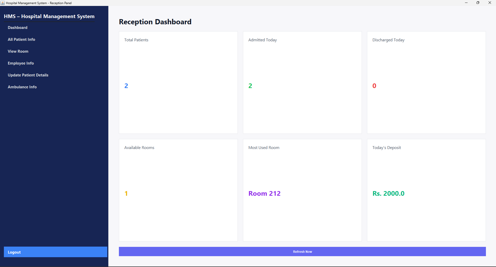
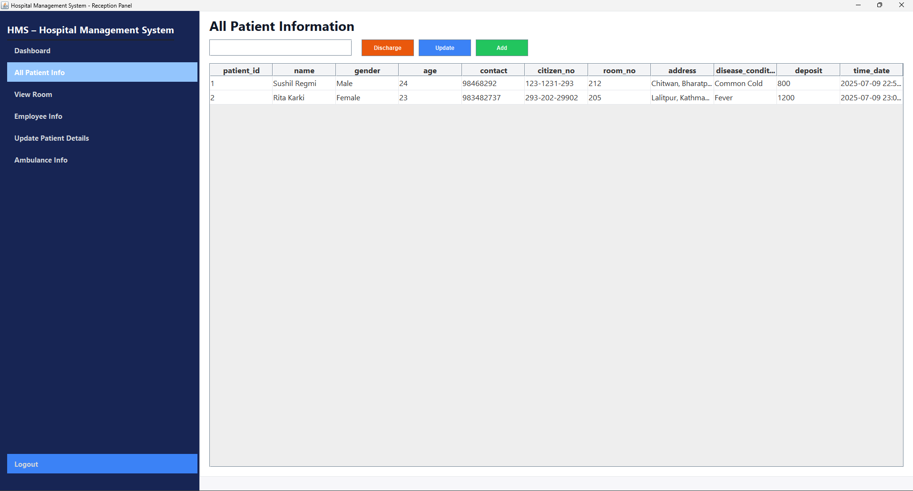
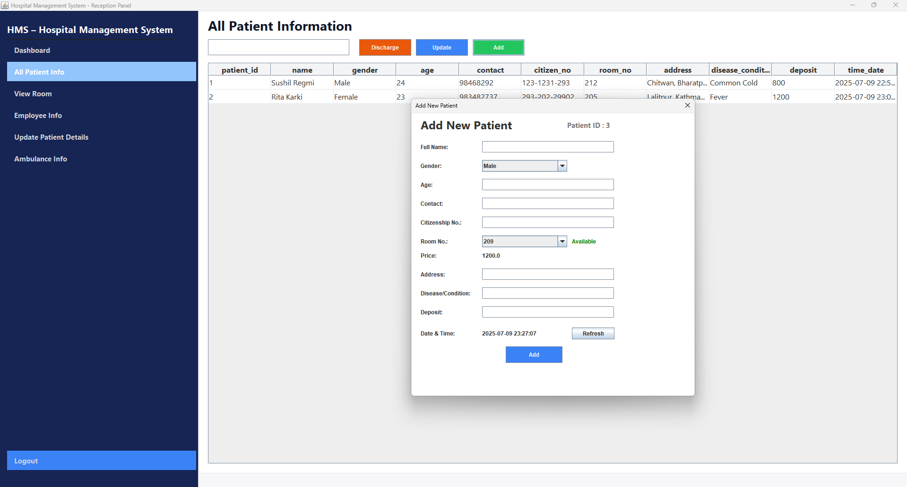
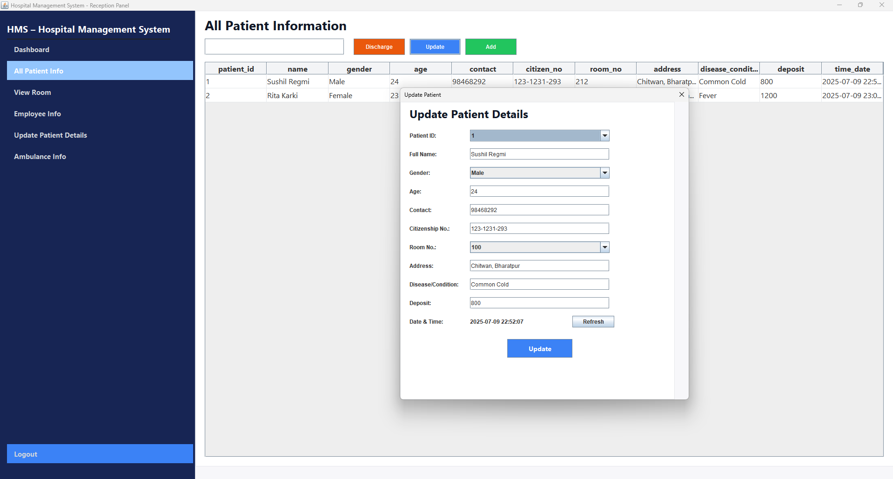
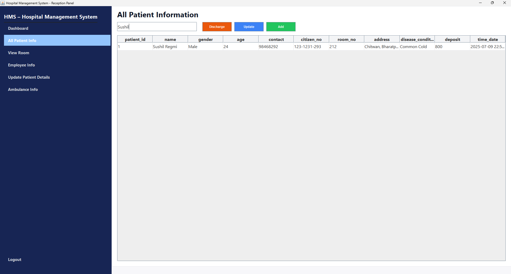
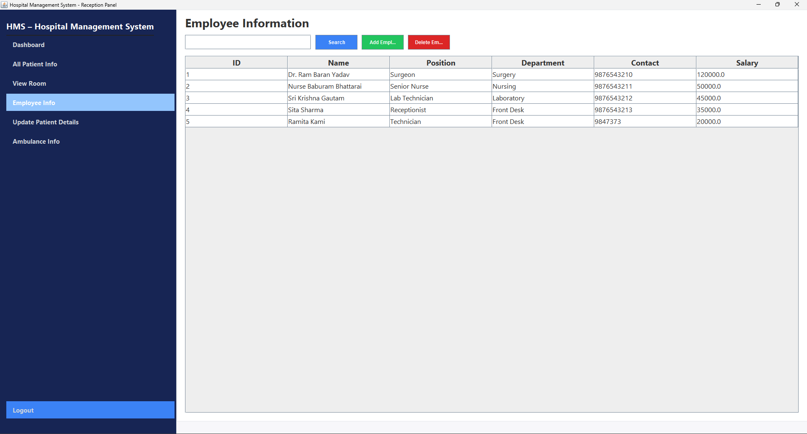
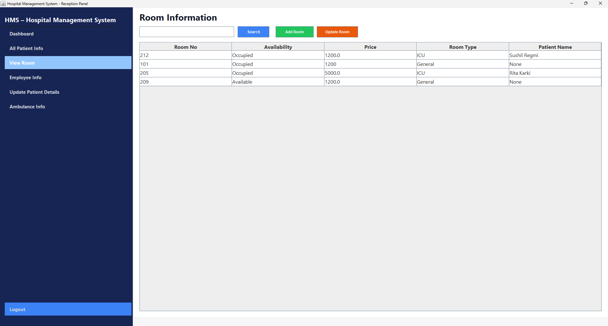

# 🏥 Hospital Management System

A simple, functional Java Swing + MySQL desktop app for managing patients, rooms, employees, and more.

## 🚀 Features

*   🔐 **Login System**: Secure MySQL authentication.
*   🧑‍⚕️ **Add New Patient**: Register patients with essential details.
*   📋 **All Patient Info**: View patient records in a table with search.
*   🏥 **Discharge Patient**: Update and record discharged patients.
*   🛏 **Room Management**: Add/view rooms and track availability.
*   👥 **Employee Info**: Manage hospital staff (add/view).
*   📊 **Dashboard**: Real-time metrics (total patients, available rooms, etc.).
*   🎨 **UI/UX**: Clean design with navy sidebar, light blue active tabs, green headers.

---

## 📸 Screenshots

<table>
<tr>
<td></td>
<td></td>
</tr>
<tr>
<td></td>
<td></td>
</tr>
<tr>
<td></td>
<td></td>
</tr>
<tr>
<td></td>
<td></td>
</tr>
</table>

---

## ⚙️ Setup Instructions

### 1\. Clone the Repository

    git clone https://github.com/your-username/hospital-management-system.git
    

### 2\. Requirements

*   Java 8+ (JDK 17 recommended)
*   MySQL 8.0+
*   MySQL Connector/J (add to classpath)
*   IDE: IntelliJ / Eclipse / NetBeans

### 3\. Database Setup

    CREATE DATABASE hospital_db;
    USE hospital_db;
    
    CREATE TABLE users (
      username VARCHAR(50) PRIMARY KEY,
      password VARCHAR(50)
    );
    
    CREATE TABLE patients (
      id INT AUTO_INCREMENT PRIMARY KEY,
      name VARCHAR(100),
      age INT,
      gender VARCHAR(20)
    );
    
    CREATE TABLE rooms (
      room_number VARCHAR(10) PRIMARY KEY,
      type VARCHAR(20)
    );
    
    INSERT INTO users (username, password) VALUES ('admin', 'admin123');
    

### 4\. Run the Project

*   Open in your IDE.
*   Update DB credentials in `conn.java`.
*   Run `Login.java`.
*   Use default credentials:
    *   Username: `admin`
    *   Password: `admin123`

## 🛠️ Future Plans

*   Complete remaining tabs and CRUD functionality.
*   Add form validation and input constraints.
*   Enhance UI with better icons and spacing.
*   Add print/export patient reports.

## 🙌 Feedback & Contact

Got ideas or issues? File an issue or reach out!  
📬 LinkedIn: [Sushil Regmi](https://linkedin.com/in/sushilre)
🌍 Portfolio: [Soocil.tech](https://soocil.tech/)

Built with 💙 in Java and SQL.
